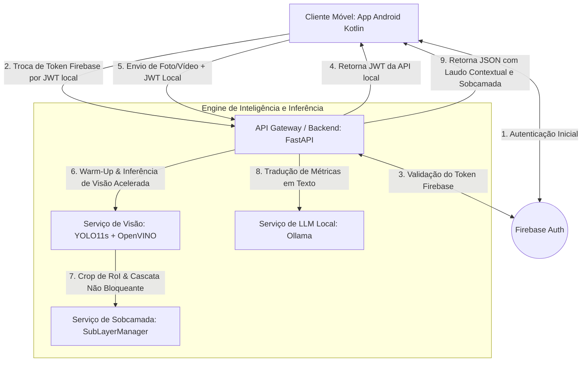

# Arquitetura de Microsserviços e Integração do Sistema

Este documento descreve a arquitetura baseada em microsserviços distribuídos e motores hierárquicos utilizada neste projeto. A solução foi projetada de forma modular, com baixo acoplamento e suporte à calibração estatística e inspeção em sobcamada para cenários de **Construção Civil, Segurança do Trabalho (NR 6 / NR 18) e Infraestrutura Governamental**.

---

## 1. Visão Geral da Arquitetura (Fluxo de Serviços)

O sistema é dividido em **componentes e serviços principais** que interagem de forma síncrona e assíncrona por meio de APIs REST e SDKs dedicados:



---

## 2. Descrição dos Microsserviços e Localização no Repositório

### 📱 2.1 Microsserviço Cliente Móvel (Android Client)
* **Função**: Ponto de interação do supervisor em campo. Captura fotos e vídeos em tempo real, autentica o usuário e exibe laudos contextuais de auditoria e alertas de sobcamada.
* **Componentes principais**:
  * **Câmera**: Captura otimizada de mídias.
  * **Autenticação**: Integração com o Firebase Auth SDK.
  * **Transmissão**: Envio via OkHttp/Retrofit (*multipart/form-data*) injetando o Bearer JWT Token local.

### 🔑 2.2 Microsserviço de Autenticação e Identidade (Firebase Auth)
* **Função**: Gerenciamento de credenciais em nuvem da plataforma Google Firebase. Emite *ID Tokens* validados em duas camadas pelo backend.

### 🚀 2.3 API Gateway e Orquestrador (FastAPI Backend)
* **Função**: Recebe solicitações, valida tokens JWT locais, impõe rate limiting e segurança, gerencia a concorrência assíncrona com `ThreadPoolExecutor` e executa o **Warm-Up dos modelos no boot**.
* **Componentes principais**:
  * **Firebase Service** ([api-tcc/app/services/firebase_service.py](file:///c:/Users/aborr/Projeto%20TCC/YOLO26l-API/api-tcc/app/services/firebase_service.py))
  * **Auth Service** ([api-tcc/app/services/auth_service.py](file:///c:/Users/aborr/Projeto%20TCC/YOLO26l-API/api-tcc/app/services/auth_service.py))
  * **Warm-Up de Modelos** (`preload_all_models` no `lifespan` do [api-tcc/main.py](file:///c:/Users/aborr/Projeto%20TCC/YOLO26l-API/api-tcc/main.py)): Garante latência zero na primeira inferência de tempo real.

### 👁️ 2.4 Microsserviço de Visão Computacional (YOLO11s + OpenVINO)
* **Função**: Processa bytes de mídias e executa a inferência visual acelerada.
* **Componentes principais**:
  * **Pesos do Modelo**: Armazenados em [models/](file:///c:/Users/aborr/Projeto%20TCC/YOLO26l-API/models/). Otimizados com Representação Intermediária (IR) do OpenVINO.
  * **Detection Service** ([api-tcc/app/services/detection_service.py](file:///c:/Users/aborr/Projeto%20TCC/YOLO26l-API/api-tcc/app/services/detection_service.py)): Aplica limiares dinâmicos por classe (`CLASS_CONFIDENCE_THRESHOLDS`) e desativação de modelos não focados em construção (`DISABLED_MODELS`).

### 🔬 2.5 Servidor de Classificação em Sobcamada ([api-tcc/app/services/sublayer_service.py](file:///c:/Users/aborr/Projeto%20TCC/YOLO26l-API/api-tcc/app/services/sublayer_service.py))
* **Função**: Sub-avaliação hierárquica em cascata sobre as regiões de interesse (RoI) dos objetos detectados.
* **Inspeções**: Trava/lacre e manômetro de extintores, capacete/colete de trabalhadores, cabine ROPS de escavadeiras, faixas refletores de cones, demarcação de vagas, etc.

### 🤖 2.6 Microsserviço de Laudo Técnico e NLP (Ollama Local)
* **Função**: Processamento de Linguagem Natural local que traduz as contagens quantitativas e alertas de sobcamada em relatórios descritivos formais na língua portuguesa.

---

## 3. Fluxo de Integração Ponta a Ponta

```text
1. [Inicialização do Backend]
    └── FastAPI executa o `preload_all_models()` aquecendo os modelos YOLO na memória RAM/GPU.

2. [Dispositivo Móvel ──> Backend (/auth/token)]
    └── Autenticação de duas camadas (Firebase -> JWT local de 24h).

3. [Dispositivo Móvel ──> Backend (/detection/analyze)]
    ├── FastAPI valida o Bearer JWT Token local.
    ├── YOLO realiza a inferência primária (piso conf=0.40 com OpenVINO).
    ├── DetectionService aplica o corte dinâmico individual da classe (ex: Máscara=0.88, Caminhão=0.64).
    ├── SubLayerManager executa a sub-avaliação hierárquica na RoI do objeto.
    ├── Ollama consolida a matriz de objetos e alertas de sobcamada em laudo técnico formal.
    └── Backend retorna o JSON estruturado contendo o status CONFORME / NÃO CONFORME e laudo textual.
```
