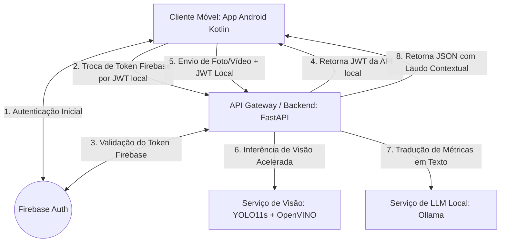

# Arquitetura de Microsserviços e Integração do Sistema

Este documento descreve a arquitetura baseada em microsserviços distribuídos utilizada neste projeto de TCC. A solução foi projetada de forma modular, fracamente acoplada e genérica para permitir a portabilidade do sistema para outros cenários de inspeção de conformidade (além de segurança do trabalho).

---

## 1. Visão Geral da Arquitetura (Fluxo de Serviços)

O sistema é dividido em **cinco componentes/serviços principais** que interagem de forma síncrona e assíncrona por meio de APIs REST e SDKs dedicados:



---

## 2. Descrição dos Microsserviços e Localização no Repositório

### 📱 2.1 Microsserviço Cliente Móvel (Android Client)
* **Função**: É o ponto de interação do usuário final (supervisor de segurança). Captura mídias (fotos e vídeos de curta duração em MP4), faz a autenticação do usuário e exibe as notificações e laudos contextuais de auditoria.
* **Componentes principais**:
  * **Câmera**: Captura de mídia otimizada.
  * **Autenticação**: Consome o Firebase Auth SDK para login.
  * **Transmissão**: Usa OkHttp/Retrofit para transferir os arquivos via requisições HTTP *multipart/form-data* injetando o Token Bearer local.
* **Localização**: Desenvolvido na linguagem Kotlin (Projeto separado `YOLO26L-ANDROID`).

### 🔑 2.2 Microsserviço de Autenticação e Identidade (Firebase Auth)
* **Função**: Plataforma de autenticação na nuvem gerenciada pelo Google. É responsável pelo cadastro, controle de acesso e emissão de tokens de identificação seguros (*ID Tokens*) para o aplicativo Android.

### 🚀 2.3 API Gateway e Orquestrador (FastAPI Backend)
* **Função**: Microsserviço de orquestração local que recebe mídias, gerencia políticas de segurança da API (Rate Limiting, IP blocking contra escaneamentos de portas 404), gerencia a validação de credenciais em duas camadas e encaminha as inferências de visão e processamento de linguagem.
* **Componentes principais**:
  * **Firebase Service** ([api-tcc/app/services/firebase_service.py](file:///c:/Users/aborr/Projeto%20TCC/YOLO26l-API/api-tcc/app/services/firebase_service.py)): Valida se o Token de ID enviado pelo celular é um token legítimo gerado pelo Google Firebase.
  * **Auth Service** ([api-tcc/app/services/auth_service.py](file:///c:/Users/aborr/Projeto%20TCC/YOLO26l-API/api-tcc/app/services/auth_service.py)): Emite e valida os Tokens JWT locais assinados de curta duração (24 horas) para a API local.
  * **Rotas da API**: Gerenciadas nos arquivos dentro de [api-tcc/app/routes/](file:///c:/Users/aborr/Projeto%20TCC/YOLO26l-API/api-tcc/app/routes/).
* **Localização**: [api-tcc/](file:///c:/Users/aborr/Projeto%20TCC/YOLO26l-API/api-tcc/)

### 👁️ 2.4 Microsserviço de Visão Computacional (YOLO11s + OpenVINO)
* **Função**: Microsserviço de Inteligência Artificial integrado ao backend que recebe bytes de mídia e realiza a inferência visual para detectar objetos como cadeiras (Fase 1) e extintores de incêndio (Fase 2).
* **Componentes principais**:
  * **Pesos do Modelo**: Armazenados em [models/](file:///c:/Users/aborr/Projeto%20TCC/YOLO26l-API/models/). O modelo é carregado no formato Intermediate Representation (IR) do OpenVINO para execução acelerada em CPUs comuns e GPUs integradas/dedicadas.
  * **Detection Service** ([api-tcc/app/services/detection_service.py](file:///c:/Users/aborr/Projeto%20TCC/YOLO26l-API/api-tcc/app/services/detection_service.py)): Lógica que processa frames usando geradores iterativos (`stream=True`) e pulo de frames em vídeos (`stride=2`) para evitar esgotamento de memória e timeout de conexão HTTP.

### 🤖 2.5 Microsserviço de Laudo Técnico e NLP (Ollama Local)
* **Função**: Microsserviço local de Processamento de Linguagem Natural (NLP) responsável por receber os dados quantitativos de detecção (ex: 0 extintores e 1 placa de sinalização detectada) e gerar um laudo contextual descritivo amigável em português para o supervisor.
* **Componentes principais**:
  * **Ollama Message Service** ([api-tcc/app/services/ollama_message_service.py](file:///c:/Users/aborr/Projeto%20TCC/YOLO26l-API/api-tcc/app/services/ollama_message_service.py)): Executa chamadas à API local do Ollama (`http://localhost:11434`), passando prompts estruturados para impedir alucinações de dados e formatar o diagnóstico operacional.

---

## 3. Fluxo de Integração Ponta a Ponta (Exemplo Prático)

O pipeline de execução de uma inspeção de conformidade ocorre sob as seguintes etapas sequenciais:

```text
1. [Dispositivo Móvel]
    └── O supervisor faz o login e recebe o Token do Firebase.

2. [Dispositivo Móvel] ──(HTTP POST com Token Firebase)──> [FastAPI Backend (/auth/token)]
    ├── FastAPI verifica o Token junto aos servidores do Firebase.
    └── Se válido, FastAPI retorna o Token JWT local da API para o celular.

3. [Dispositivo Móvel]
    ├── O supervisor aponta a câmera para um suporte de extintor vazio.
    └── Grava um vídeo curto de 10 segundos em MP4.

4. [Dispositivo Móvel] ──(HTTP POST com MP4 + Token JWT Local)──> [FastAPI Backend (/detection/analyze)]
    ├── FastAPI valida o Token JWT local da API (Autorização Bearer).
    ├── O arquivo de vídeo é desmembrado e enviado para o [Serviço de Visão (YOLO + OpenVINO)].
    │    ├── O YOLO analisa 1 a cada 2 frames (Stride=2) consumindo pouca CPU.
    │    ├── Retorna uma matriz estruturada contendo a contagem de classes detectadas.
    │    └── Exemplo: {"extintor_incendio": 0, "placa_sinalizacao": 1}.
    ├── O backend envia essa matriz de contagem para o [Serviço de LLM (Ollama)].
    │    ├── O LLM roda um prompt de auditoria contextual: "Se placa=1 e extintor=0 -> Alerta".
    │    └── Retorna a mensagem formatada: "ALERTA DE SEGURANÇA: Placa obrigatória localizada, mas nenhum extintor foi detectado no suporte. Risco grave de incêndio sem combate no canteiro!".
    └── O backend empacota o laudo textual, o status de conformidade ("NÃO CONFORME") e a contagem de objetos em um JSON de resposta rápida.

5. [Dispositivo Móvel]
    └── Recebe o JSON e apresenta na tela o alerta vermelho com o laudo de não conformidade para o supervisor.
```

---

## 4. Diferenciais de Desempenho e Robustez do Sistema

* **Autenticação em Duas Camadas**: Garante que o backend não gaste processamento pesado de CPU e inferência de visão com requisições fantasmas ou bots, exigindo primeiro um token válido do Google Firebase para conceder o token de acesso à API.
* **Processamento de Vídeo Otimizado**: A amostragem por *stride* descarta frames desnecessários, reduzindo o tempo de processamento em até 50%. A inferência com `stream=True` consome pouquíssima memória RAM, pois os frames são limpos da memória logo após a inferência.
* **OpenVINO CPU Acceleration**: Eleva de forma substancial os frames processados por segundo (FPS) mesmo rodando em hardware convencional de CPU (sem necessidade de placas de vídeo NVIDIA caras), barateando o custo de infraestrutura do projeto.
* **Laudos Determinísticos via LLM Local**: Ollama roda de forma privada no próprio servidor da obra, sem vazar imagens ou relatórios para APIs comerciais (como a OpenAI) e sem custos extras.
