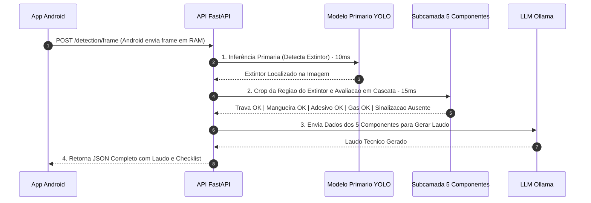

# 📐 Diagrama de Fluxo de Comunicação: Android ↔️ API FastAPI

Este documento ilustra visualmente a causa raiz do problema que ocorria com o aviso `"conformidade disable"` e como a API foi corrigida para garantir o envio do laudo do **Ollama** e dos **5 componentes do extintor**.

---

## 🎨 Diagrama Visual em Caixa (ASCII / Universal)

```text
  +-----------------------------------------------------------------------------------+
  |                             APP ANDROID (KELVINTECH)                              |
  +-----------------------------------------------------------------------------------+
                                           |
                                           |  1. POST /detection/frame (Frame em RAM)
                                           v
  +-----------------------------------------------------------------------------------+
  |                                API FASTAPI (BACKEND)                              |
  +-----------------------------------------------------------------------------------+
                                           |
                    +----------------------+----------------------+
                    |                                             |
                    v                                             v
  +-----------------------------------+         +-----------------------------------+
  |  MODELO PRIMÁRIO YOLO (INTEL GPU) |         |  SUB-CAMADA INSPEÇÃO (5 ITENS)    |
  |  Detecta Extintor de Incêndio     |         |  • Trava de Segurança             |
  |  em ~10ms na RAM                  |         |  • Mangueira / Difusor            |
  +-----------------------------------+         |  • Adesivo / Rótulo               |
                    |                           |  • Carga de Gás / Manômetro       |
                    +--------------------->     |  • Sinalização de Emergência      |
                                                +-----------------------------------+
                                                                  |
                                                                  v
                                                +-----------------------------------+
                                                |     LLM OLLAMA (QWEN2.5-CODER)    |
                                                |  Gera Laudo Técnico Descritivo    |
                                                |  em tempo real                    |
                                                +-----------------------------------+
                                                                  |
                                                                  v
  +-----------------------------------------------------------------------------------+
  |                     RESPOSTA JSON RETORNADA AO APP ANDROID                        |
  |  • Status: "NÃO CONFORME"                                                         |
  |  • Laudo: "A análise identificou 1 Extintor. 4 itens OK; Alerta: Sinalização."   |
  |  • Checklist: 5 Componentes (Passed / Failed)                                     |
  |  • Boxes: [] (Retângulos ocultos)                                                 |
  +-----------------------------------------------------------------------------------+
```

---

## 📊 Diagrama de Sequência Mermaid (Standard)



---

## 📄 Estrutura Exata do JSON Retornado ao Android

```json
{
  "success": true,
  "requested_model": "extintor e sua sinalização",
  "compliance_status": "NÃO CONFORME",
  "compliance_alerts": [
    "Placa de sinalização de emergência ausente no suporte de parede!"
  ],
  "compliance_report": "A análise da cena identificou 1 Extintor de Incêndio. Componentes conformes: Trava de Segurança, Mangueira/Difusor, Adesivo de Instruções e Carga de Gás; Irregularidade: Placa de Sinalização ausente. Status: Não Conforme.",
  "sub_layer_analysis": [
    {
      "object_class": "extintor de incêndio",
      "category": "Prevenção contra Incêndio",
      "is_conforming": false,
      "passed_items": [
        "Trava / Lacre de Segurança",
        "Carga de Gás / Manômetro de Pressão",
        "Mangueira / Difusor de Incêndio",
        "Adesivo / Rótulo de Instruções"
      ],
      "failed_items": [
        "Placa de Sinalização de Emergência"
      ],
      "alerts": [
        "Placa de Sinalização de Emergência ausente no suporte de parede!"
      ]
    }
  ],
  "boxes": []
}
```
