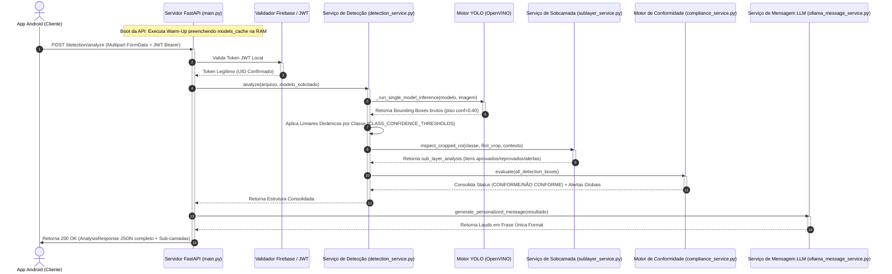

# Fluxo de Funcionamento do Sistema - API TCC

Este documento descreve a arquitetura geral da API TCC e detalha a jornada completa de uma requisição — desde o boot do servidor até a entrega dos resultados enriquecidos com Inteligência Artificial, inspeção em sobcamada e laudos de conformidade.

---

## 1. Visão Geral da Arquitetura

A API é construída sob o framework **FastAPI** (Python 3.10+) e opera em conformidade com o padrão de **Microsserviços/SOA**. O sistema se apoia em quatro pilares fundamentais:

1. **Warm-Up no Startup**: Carregamento imediato de todos os modelos na inicialização (`preload_all_models`), garantindo latência zero na inferência em tempo real.
2. **Inferência YOLO Acelerada + Limiares Dinâmicos**: Runtime **Intel OpenVINO** com calibração estatística por classe ($\tau_{\text{sugerido}} = 1,4\mu - 1,5\sigma$).
3. **Motor de Classificação em Sobcamada (Sub-layer Inspection)**: Inspeção hierárquica em cascata sobre as regiões de interesse (RoI) dos objetos detectados (ex: travas, manômetro, faixas refletivas).
4. **Laudo em Linguagem Natural (LLM local com Ollama)**: Geração de laudos descritivos contextuais dinâmicos em português.

---

## 2. Diagrama de Sequência do Fluxo de Requisição

---

## 3. Detalhamento Etapa por Etapa

### Etapa 1: Warm-Up e Inicialização Instantânea
* Na inicialização da API, o evento `lifespan` executa `preload_all_models()`.
* Todos os modelos da pasta `models/` (exceção dos mapeados em `DISABLED_MODELS`) são carregados na RAM/GPU no boot, evitando latência no primeiro uso em tempo real.

### Etapa 2: Barreiras de Segurança e Autenticação
* **Firebase & JWT Local**: O token enviado no cabeçalho `Authorization: Bearer` é verificado.
* **Rate Limiting & Anti-DDoS**: Bloqueio contra rajadas de tráfego e varreduras 404.

### Etapa 3: Inferência e Limiares Dinâmicos por Classe
* O modelo YOLO roda em piso seguro `conf=0.40`.
* Cada caixa delimitadora é filtrada pelo seu limiar dinâmico individual (`CLASS_CONFIDENCE_THRESHOLDS`), calculado estatisticamente ($\tau_{\text{sugerido}} = 1,4\mu - 1,5\sigma$).

### Etapa 4: Classificação em Sobcamada (Sub-layer Inspection)
* Para cada objeto detectado, a região de interesse (RoI) é recortada e enviada ao `SubLayerManager`.
* O sistema avalia itens essenciais de construção civil e segurança (ex: trava/lacre e pressão no extintor, jugular no capacete, cabine ROPS na escavadeira).

### Etapa 5: Motor de Conformidade e Laudo LLM
* As inconformidades de cena e alertas de sobcamada são consolidados em `compliance_alerts`.
* O `OllamaMessageService` gera o laudo descritivo formal em português para exibição no aplicativo móvel.
