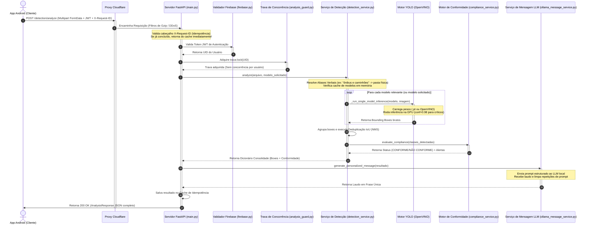

# Fluxo de Funcionamento do Sistema - API TCC

Este documento descreve a arquitetura geral da API TCC e detalha a jornada completa de uma requisição — desde o momento em que o aplicativo móvel Android realiza o upload de uma mídia até a entrega final dos resultados enriquecidos com Inteligência Artificial.

---

## 1. Visão Geral da Arquitetura

A API é construída sob o framework **FastAPI** (Python 3.12) e opera em conformidade com o padrão de **Microsserviços/SOA**. O sistema se apoia em três pilares fundamentais:
1. **Inferência YOLO**: Processamento paralelo de múltiplos modelos usando o runtime otimizado **Intel OpenVINO** com aceleração via GPU Intel Arc.
2. **Motor de Conformidade (Compliance)**: Validação lógica de regras de segurança do trabalho baseada nos objetos detectados.
3. **Resumo Natural (LLM local com Ollama)**: Geração de laudos e alertas textuais contextuais dinâmicos em português usando o modelo `qwen2.5-coder`.

---

## 2. Diagrama de Sequência do Fluxo de Requisição

O diagrama abaixo ilustra o caminho síncrono completo que uma requisição percorre pela infraestrutura da aplicação:

---

## 3. Detalhamento Etapa por Etapa

### Etapa 1: Envio do Cliente e Mapeamento de Idempotência
* O aplicativo móvel Android efetua um upload de imagem/vídeo para a rota `/detection/analyze`.
* Um cabeçalho único `X-Request-ID` é anexado à chamada.
* Se a rede sofrer oscilações ou falhar no meio do envio e o Android reenviar o arquivo com o mesmo `X-Request-ID`, o servidor intercepta a requisição, localiza o resultado da inferência original já processada e o devolve instantaneamente, economizando recursos de GPU.

### Etapa 2: Barreiras de Segurança e Proteção
* **Gzip Route**: Descompacta payloads comprimidos de forma transparente.
* **Firebase Security**: Valida que o token JWT enviado veio de uma sessão de usuário real e decodifica o UID do usuário.
* **Analysis Guard**: Implementa um semáforo de concorrência por usuário. Se o mesmo usuário enviar 5 fotos ao mesmo tempo, a API serializa as chamadas em fila para não estourar a memória RAM do servidor.

### Etapa 3: Seleção e Carregamento de Modelos
* A API suporta **23 modelos YOLO** individuais.
* A API recebe nomes descritivos e amigáveis em português (como `ônibus e caminhões` ou `extintor e sua sinalização`) e mapeia-os transparentemente para as pastas físicas de pesos correspondentes.
* Os modelos são mantidos em cache na memória RAM (`models_cache`) após o primeiro carregamento para evitar o atraso de leitura de disco nas próximas inferências.

### Etapa 4: Inferência e Regras de Limiar (Threshold)
* O processamento é executado dentro do `ThreadPoolExecutor` global compartilhado para evitar vazamento de threads.
* Para modelos gerais (como cadeira), o limiar de confiança configurado é de `85%`.
* Para modelos de alta incidência de falsos positivos em ambientes normais (como máquinas de obras e escavadeiras que podem confundir mangueiras de extintores), a API força um limiar de **`98%`**, garantindo que apenas objetos reais sejam detectados.

### Etapa 5: Deduplicação de Bounding Boxes (NMS)
* Quando múltiplos modelos são executados sobre a mesma imagem (varredura global `all`), diferentes modelos podem gerar retângulos sobrepostos sobre o mesmo objeto.
* A API aplica um algoritmo customizado de **Interseção sobre União (IoU)** para unificar e limpar detecções redundantes antes de contar os objetos.

### Etapa 6: Motor de Conformidade (EPIs e Segurança)
* Os objetos consolidados são enviados para o `ComplianceService`. Ele valida regras lógicas pré-estabelecidas baseadas nas normas de segurança:
  * Exemplo 1: Se `pessoa` for detectada mas `safety_vest` (colete) ou `hardhat` (capacete) não forem encontrados, a cena é marcada como `NÃO CONFORME` e um alerta de EPI é registrado.

### Etapa 7: Geração de Mensagem Natural (LLM)
* O serviço `OllamaMessageService` envia o resumo de objetos e o status de conformidade para o Ollama local.
* O LLM (`qwen2.5-coder`) gera uma frase humana descritiva em português sobre o estado do ambiente.
* A API faz o pós-processamento da resposta do LLM para remover eventuais resíduos ou repetições.

### Etapa 8: Resposta ao Cliente
* A API responde com o status `200 OK` contendo o payload estruturado `AnalysisResponse` (contagens, caixas delimitadoras detalhadas com coordenadas, status de conformidade, alertas e a mensagem do LLM).
